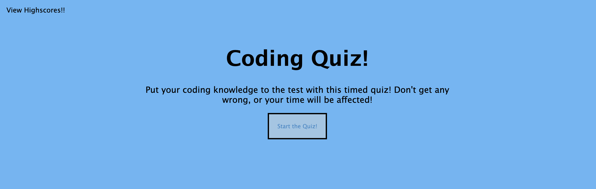

# Kendalls-Coding-Quiz

This application is a coding quiz that tests a user's knowledge of coding. The user is presented with a series of questions and is given a time limit to answer each question. If the user answers a question incorrectly, ten seconds are subtracted from the clock. The user is able to save their initials and score to the highscores page and can view and clear the highest scores. 

HTML and CSS are used to create the structure and style of the page. Javascript is used to create the functionality of the page.

## Installation 

To install this application you will want to clone the repository to your local machine.

## Usage 

When you are ready to use this application, you will click Start the Quiz on the main page. The first question will appear and the timer with begin. Once you select your answer be sure to click next question. Once you reach the end of the quiz you will be presented with your score and be asked if you would like to save your score. If you do, you will be asked to enter your initials. Once you have entered your initials, your score will be saved and you will be taken to the highscores page. You will be able to view all highscores.

